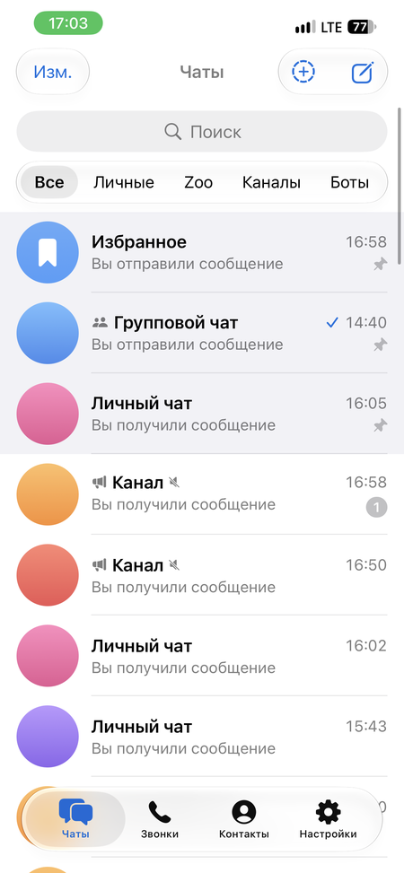
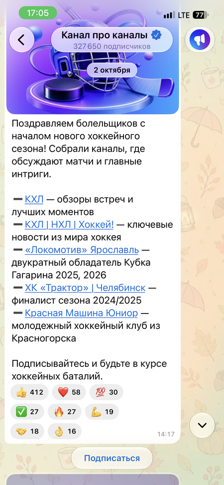
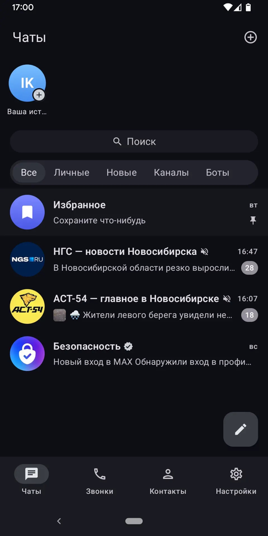
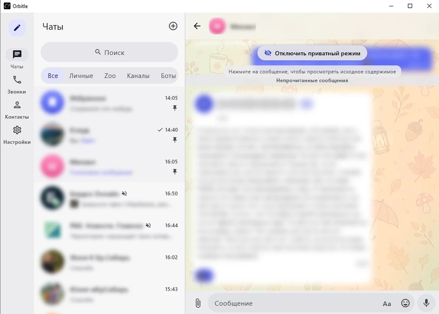
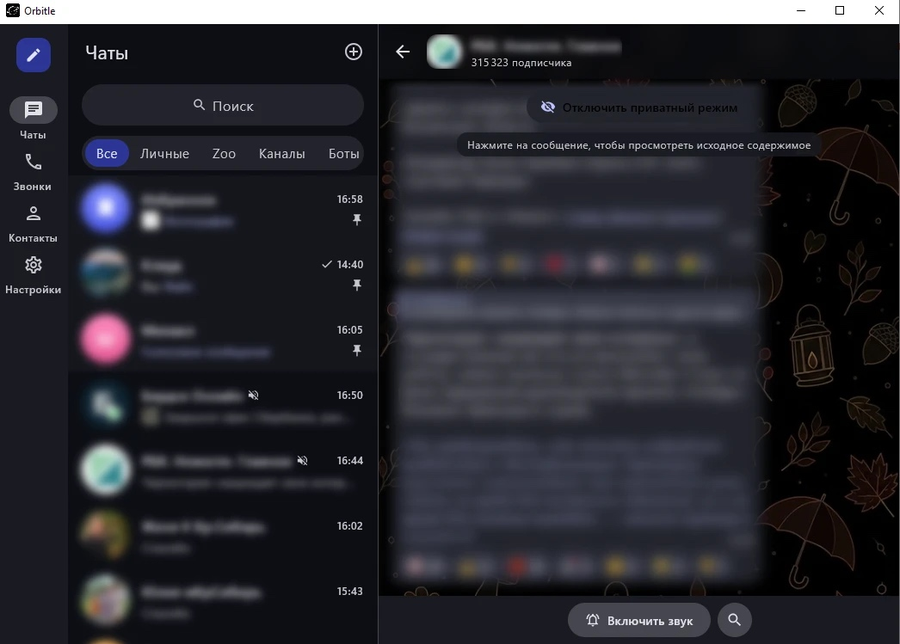

  <picture>
    <source media="(prefers-color-scheme: dark)" srcset="docs/brand/maxly-logo-black.png">
    <source media="(prefers-color-scheme: light)" srcset="docs/brand/maxly-logo-white.png">
    
  </picture>

<h1 align="center">Maxly</h1>

  
  
  
  
  
  
  
  
  

  
  
  

Maxly — нативный клиент мессенджера MAX. Протокол, сеть, вход, хранение сессии и логика
сервера живут в общем ядре [maxly-core](https://github.com/fighxy/maxly-core) на Kotlin
Multiplatform, Maxly отвечает за нативный интерфейс на каждой платформе.

Все три клиента рабочие и умеют одно и то же. iOS-клиент — SwiftUI под iOS 26 со стеклом
Liquid Glass (минимальная версия iOS 17, на iOS 17–18 вместо стекла системные материалы).
Android-клиент и клиент для компьютера написаны на Kotlin и делят модули `maxly-shared`
(модели, данные, view model, протокол звонков) и `maxly-compose` (общие экраны). Токен сессии хранит ядро. У десктопа свой каталог `~/.maxly` и
своё пространство сессии `maxly-desktop`, оно не делит вход с Android.

## Скриншоты

Версия на 09.10.2026.

  
  
  

  
  

## Платформы

| Каталог | Платформа | UI | Ядро | Состояние |
|---|---|---|---|---|
| [`maxly-ios/`](maxly-ios/) | iOS 17+ (собирается с SDK iOS 26) | SwiftUI, Liquid Glass | статический `MaxlyCore.xcframework`, ревизия в `maxly-ios/core.lock` | рабочий клиент |
| [`maxly-android/`](maxly-android/) | Android | Kotlin, Jetpack Compose, Material 3 | AAR ядра в `maxly-android/vendor`, ревизия в `maxly-android/core.lock` | рабочий клиент |
| [`maxly-desktop/`](maxly-desktop/) | Windows, macOS, Linux (JVM) | Compose Multiplatform | исходники JVM ядра, ревизия в `maxly-desktop/core.lock` | рабочий клиент |

## Ядро

[maxly-core](https://github.com/fighxy/maxly-core) — общее ядро всех трёх клиентов на Kotlin Multiplatform: протокол MAX, соединение и переподключение, вход, хранение сессии, чаты, сообщения, вложения и серверная часть звонков (начало, приём и завершение звонка, параметры подключения, адрес сигнального канала). Сигналинг звонка (SDP, ICE, слоты сервера) сделан в клиентах отдельно на Swift и на Kotlin, а согласованность держат общие сценарии в `test-fixtures/calls/ws2`. Каждый клиент закреплён на своей ревизии ядра в `core.lock`.

## Что умеет iOS-клиент

- **Вход:** номер с маской и выбором страны, SMS-код с повторной отправкой, пароль 2FA,
  регистрация, вход по сохранённому токену, подтверждение входа на другом устройстве по QR,
  панель ограничений нового сеанса.
- **Список чатов:** папки сервера, закреплённые чаты с перестановкой, «без звука», пометка
  непрочитанным (на устройстве), состояния загрузки и сети.
- **Поиск:** по загруженным чатам и недавние запросы, на сервере — публичные чаты и каналы
  («Глобальный поиск») и сообщения во всех чатах («Сообщения»).
- **Чат:** история страницами, текст с форматированием, ответы, правка, удаление у себя и у
  всех, пересылка, отметки прочтения, «Пометить непрочитанным» с сообщения, «печатает»,
  комментарии к постам каналов, разделитель «Непрочитанные сообщения» (чат открывается на нём),
  превью ссылок (`SHARE`). Канал или группа из поиска открываются с названием из карточки и
  кнопкой «Подписаться» / «Вступить» вместо поля ввода; из профиля — «Отписаться» от канала
  и «Покинуть группу».
- **Боты:** inline-кнопки (ответ бота — уведомлением или ссылкой, кнопки-ссылки, копирование,
  мини-приложение), кнопка «Открыть приложение» у ботов с мини-приложением.
- **Реакции:** выбор, список поставивших, анимодзи сервера.
- **Вложения:** фото, видео, файлы и контакты с прогрессом и отменой, просмотр медиа и
  документов, сохранение в «Фото» и «Файлы».
- **Голосовые и кружки:** запись с удержанием, блокировкой и отменой, воспроизведение,
  расшифровка голосовых.
- **Эмодзи и стикеры:** панель на месте клавиатуры, наборы стикеров, анимодзи (Lottie).
- **Шапка чата и профиль:** пользователи, боты, группы и каналы, общие медиа из кэша.
- **Истории:** спрятаны над поиском, кольца на аватарах, просмотр на весь экран, публикация
  фото и видео на сутки всем или только контактам.
- **Звонки:** входящие и исходящие, личные и групповые, по ссылке, через сервер с плитками
  участников; микрофон, камера и её смена, громкая связь, показ экрана, запись, переподключение,
  плашка идущего звонка, CallKit, журнал с удалением на сервере.
- **Контакты:** список контактов с поиском.
- **Настройки:** профиль и аватар, безопасность (пароль, безопасный режим, конфиденциальность,
  чёрный список, приватный режим), устройства и сеансы, данные и память, папки, оформление
  (размер текста, тема), мини-приложения, «О приложении» с журналом и отчётами о сбоях.
- **Приватный режим:** прячет названия, аватары и тексты на экране, сообщение открывается
  касанием на время.
- **Плавность:** единые анимации появления и удаления сообщений, строк списка, реакций и
  панели вкладок, с учётом «Уменьшения движения».

## Что умеют Android и компьютер

Оба клиента написаны на Kotlin и делят `maxly-shared` (модели, данные, view model, протокол звонков) и `maxly-compose` (шапка списка чатов, экран звонка). На Android используется Jetpack Compose и Material 3, на компьютере — Compose Multiplatform для Windows, macOS и Linux.

- **Вход:** номер с маской и выбором страны, SMS-код с повтором, облачный пароль, регистрация, восстановление сессии, панель ограничений нового сеанса.
- **Список чатов:** папки сервера с бейджами, закреплённые чаты с перестановкой, превью, черновики, «печатает…», «без звука», поиск, плашка соединения. Шапка как на iOS: поиск и папки капсулами, истории спрятаны над поиском.
- **Чат:** история без предела вверх, ответы с цитатой, пересылка, правка, удаление у себя и у всех, реакции, отметки прочтения, «Пометить непрочитанным», разделитель «Непрочитанные сообщения», превью ссылок, комментарии к постам, inline-кнопки ботов и мини-приложения, «Подписаться» / «Вступить» для каналов и групп из поиска.
- **Вложения:** фото, видео, файлы, контакты, стикеры.
- **Голосовые и кружки:** запись удержанием, отмена и закрепление жестом, как на iOS. Кружки на Android снимает CameraX, на компьютере — камера через WebRTC, собирает их ffmpeg.
- **Истории:** полоса и кольца на аватарах, просмотр на весь экран, публикация фото и видео на сутки всем или контактам.
- **Звонки:** личные и групповые, по ссылке, через сервер (SFU) с плитками участников, микрофон, камера, громкая связь, показ экрана, запись для админа, переподключение, свёрнутый звонок, журнал с пропущенными. На Android есть полноэкранный входящий звонок и служба переднего плана.
- **Контакты и настройки:** контакты с поиском, устройства и сеансы, оформление (тема, размер текста, обои), приватный режим.
- **Компьютер:** список и чат открыты рядом, горячие клавиши для чатов, ответов, папок и звонков (работают в любой раскладке), встроенный проигрыватель видео на ffmpeg.

Подробности — в [maxly-android/README.md](maxly-android/README.md) и [maxly-desktop/README.md](maxly-desktop/README.md).

## Устройство репозитория

| Путь | Что там |
|---|---|
| [`maxly-ios/`](maxly-ios/) | Xcode-проект, Swift-пакет со слоями, тесты, документация iOS-клиента |
| [`maxly-android/`](maxly-android/) | Android-приложение, `scripts/fetch-core.sh` (AAR ядра по `core.lock`) |
| [`maxly-desktop/`](maxly-desktop/) | клиент для компьютера, `scripts/fetch-core.sh` (исходники ядра по `core.lock`) |
| [`maxly-shared/`](maxly-shared/) | общий Kotlin-код Android и десктопа: модели, данные, view model, протокол звонков и их тесты |
| [`maxly-compose/`](maxly-compose/) | общие Compose-экраны Android и десктопа: шапка списка чатов, экран звонка |
| [`test-fixtures/calls/ws2/`](test-fixtures/calls/ws2/) | общие сценарии сигналинга звонков, их проигрывают тесты Swift и Kotlin |
| [`scripts/`](scripts/) | `fetch-core.sh` (ядро для iOS), `fetch-core.ps1` (исходники ядра для десктопа на Windows), `build-ipa.sh`, `smoke-launch.sh`, `validate-ipa.py`, `publish-latest.sh` (пререлизы `*-latest`) |
| [`docs/`](docs/) | общая архитектура клиентов, памятка по клиенту Komet, бренд |
| [`.github/workflows/`](.github/workflows/) | CI: `ios.yml` (тесты, сборка, запуск в симуляторе, `.ipa`), `android.yml` (тесты, `.apk`), `desktop.yml` (тесты, установщики `.deb`, `.msi`, `.dmg`) |

## Установка

У каждой платформы один пререлиз с постоянной ссылкой: его заменяет каждая зелёная сборка
`main` ([Releases](https://github.com/fighxy/Maxly/releases)).

**iPhone.** Неподписанная сборка в пререлизе `ios-latest`:
https://github.com/fighxy/Maxly/releases/download/ios-latest/Maxly.ipa.
Откройте ссылку в Safari на iPhone, затем подпишите и установите `.ipa` своим сертификатом
(eSign, Sideloadly, AltStore и т. п.).

**Android.** Пререлиз `android-latest`:
https://github.com/fighxy/Maxly/releases/download/android-latest/Maxly.apk.
Ссылку можно открыть прямо на телефоне и установить `.apk`.

**Компьютер.** Пререлиз `desktop-latest`: Windows —
https://github.com/fighxy/Maxly/releases/download/desktop-latest/Maxly.msi, macOS —
https://github.com/fighxy/Maxly/releases/download/desktop-latest/Maxly.dmg, Linux —
https://github.com/fighxy/Maxly/releases/download/desktop-latest/Maxly.deb. Установщики
каждого прогона есть и в артефактах `Maxly-desktop-<формат>-<sha>`. Собрать и запустить
самому — в [maxly-desktop/README.md](maxly-desktop/README.md).

## Документация

- [docs/architecture.md](docs/architecture.md) — слои клиентов и роль ядра.
- [docs/pins.md](docs/pins.md) — несколько закрепов в одном чате.
- [docs/scheduled.md](docs/scheduled.md) — отложенные сообщения и счётчики опросов.
- [docs/komet-reference.md](docs/komet-reference.md) — карта функций клиента Komet (сверка поведения).
- [docs/komet-gap-map.md](docs/komet-gap-map.md) — чего нет в Maxly по сравнению с Komet, по платформам, и план работ.
- [docs/account-limits.md](docs/account-limits.md) — ограничения аккаунта после входа и регистрации на всех платформах.
- [docs/photo-editor.md](docs/photo-editor.md) — расширенный редактор фото на трёх платформах.
- [maxly-ios/README.md](maxly-ios/README.md) — iOS-клиент: слои, сборка, CI, указатель документов.
- [maxly-android/README.md](maxly-android/README.md) — Android-клиент: сборка, подпись, CI.
- [maxly-desktop/README.md](maxly-desktop/README.md) — клиент для компьютера: запуск, что готово.
